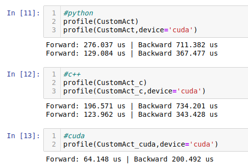

# Pytorch custom activation function

Implemention and guide on the making of a Pytorch custom activation function with autodifferentation, c++ and cuda bindings.

To see the process with references about how to make your own function and classes on Pytorch and how to import the one on this repository go to the [Exploratory notebook](Exploratory_notebook.ipynb).

## Result:

## Credits

The original idea of the activation function is from [Javiabellan](https://github.com/javiabellan). For further discussion you can see [this thread on Twitter](https://twitter.com/javifreemind/status/1199268347927572480).
